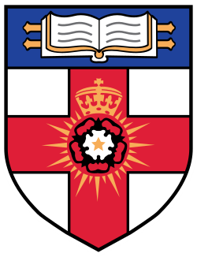

 

---

## About me

I'm a Data Science and Business Analytics graduate (First Class Honours, University of London under the academic direction of LSE) who spent five years playing professional cricket in Sri Lanka's domestic circuit before going all in on AI.

These days I build things with machine learning and LLMs: RAG chatbots, forecasting models, computer vision pipelines, and the occasional deep dive into sports data.

-  Building with RAG, agents and multi-agent systems
-  Going deeper on AI Governance and Safety
-  Writing about data and AI on [Medium](https://medium.com/@bhagyadissanayake)
-  Ask me about how data science and AI fits into cricket or MMA.

---

## 🧰 Tech Stack

 

**Machine learning**
 

**Generative and Agentic AI**
 

**Data Analytics**
 

**MLOps and Cloud**
 

---

## 🎓 Education and Certifications

&nbsp;&nbsp;

**BSc Data Science and Business Analytics**, University of London (academic direction from LSE)
 
First Class Honours

 

---

## 🏏 Beyond Data Science

I played professional cricket from 2019 to 2024, representing **Sri Lanka Navy** and **Burgher Recreation Club** in Sri Lanka's premier domestic circuit. Before that I received 1st XI colours at Royal College, Colombo, and won all-island titles at both U15 and U19 level.

It taught me more about teamwork, discipline and performing under pressure than any course has. It's also why I can't look at a scorecard without wanting to build a model on it.

[ESPNcricinfo player profile](https://www.cricinfo.com/cricketers/bhagya-dissanayake-1214966)

---

**Open to collaborating on AI/ML, LLM and sports analytics projects.** Say hi at [bhagyasdi@gmail.com](mailto:bhagyasdi@gmail.com).

